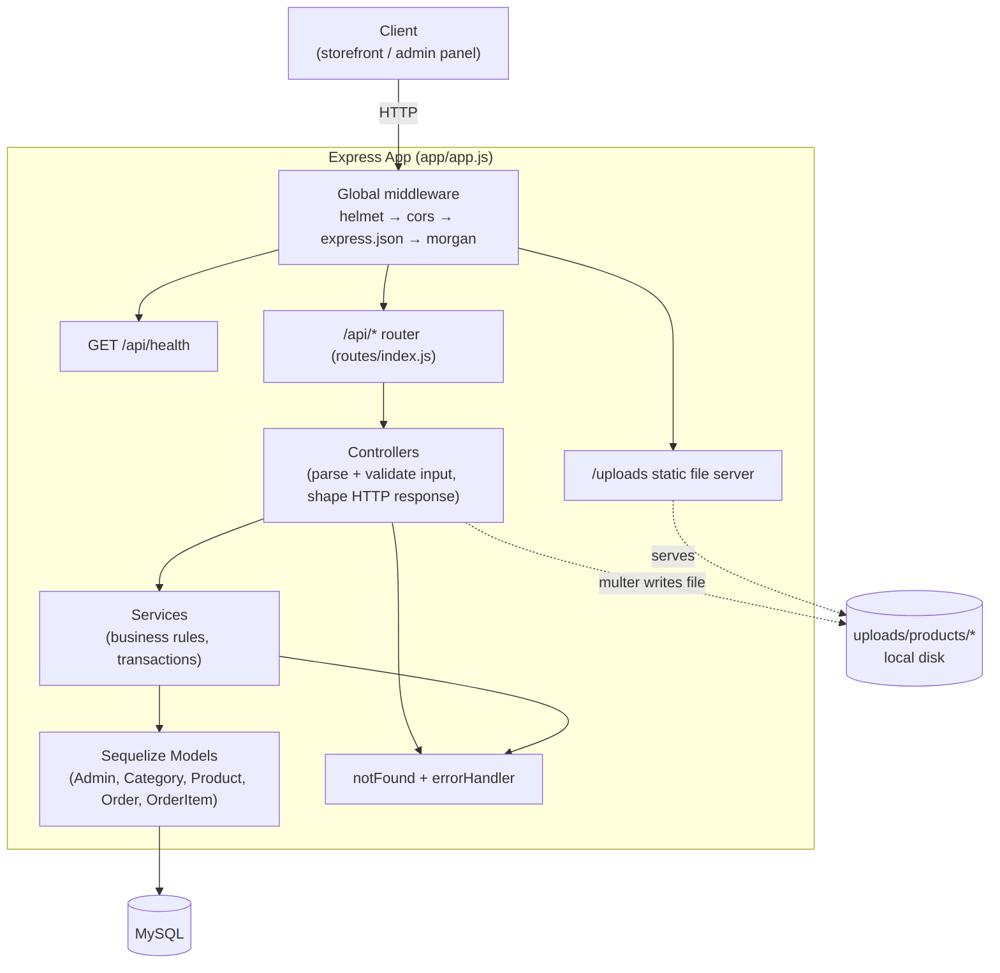

# System Design

## Tech stack

| Concern | Choice |
|---|---|
| Runtime | Node.js, ES Modules (`"type": "module"`) |
| Web framework | Express 5 |
| ORM | Sequelize 6 (`mysql2` driver) |
| Database | MySQL |
| Auth | JWT (`jsonwebtoken`), passwords hashed with `bcryptjs` |
| File upload | `multer` (disk storage) |
| Security headers | `helmet` |
| CORS | `cors`, restricted to a single `CLIENT_URL` origin |
| Rate limiting | `express-rate-limit` (per-IP, on login and order creation) |
| Logging | `morgan` (`dev` format locally, `combined` in production) |
| Dev tooling | `nodemon` |

## Architecture: layered, single process

**Why this split:**
- **Routes** (`routes/*.routes.js`) — only wire HTTP method + path + middleware (auth, rate limit, upload) to a controller function. No logic.
- **Controllers** (`controllers/*.controller.js`) — read `req.body`/`req.params`/`req.query`, validate and normalize every field by hand (no schema validation library is used — validation is manual, per-field), call a service, and shape the HTTP response. They never touch Sequelize models directly.
- **Services** (`services/*.service.js`) — own the business rules: price calculation, order status transitions, transactional writes, uniqueness/FK error translation. They never touch `req`/`res`.
- **Models** (`models/*.model.js`) — Sequelize schema definitions only, wired together with associations in `models/index.js`.

This keeps HTTP concerns, business rules, and persistence independently testable/replaceable, even though no tests currently exist (see [known issues](./05-known-issues.md)).

## Request lifecycle

1. Request hits `app/app.js`'s middleware stack in order: `helmet()` → `cors({ origin: CLIENT_URL })` → `express.json()` → `helmet({ crossOriginResourcePolicy: 'cross-origin' })` → `morgan(...)`.
2. `/uploads/*` is served as static files directly (product images), bypassing the API router.
3. `/api/health` checks DB connectivity and returns independent of the rest of the app.
4. Everything else under `/api` goes through `routes/index.js`, which fans out to `auth`, `categories`, `products`, `orders` sub-routers.
5. Protected routes run `middleware/auth.js` first: it reads `Authorization: Bearer <token>`, verifies it with `JWT_SECRET`, and attaches `req.admin = { id, username }`. No token or an invalid/expired one throws a `401 AppError` before the controller runs.
6. Controllers wrap their async body in `asyncHandler` (`utils/asyncHandler.js`), so any thrown error (including inside `await`) is forwarded to Express's error pipeline via `next(err)` instead of crashing the process.
7. Business errors are thrown as `AppError(message, statusCode)` (`utils/AppError.js`) and marked `isOperational = true`.
8. Unmatched routes hit `notFound` → a 404 `AppError`. All errors converge on `errorHandler` (`middleware/errorHandler.js`): operational errors return their real `message` and `statusCode`; anything unexpected (a bug, a raw DB error) is logged server-side and returned to the client as a generic `500 "Something went wrong"` — so internals never leak to the client.

## Security measures present

- **Password storage:** bcrypt, cost factor 12 (`scripts/seedAdmin.js`).
- **Auth:** stateless JWT, `JWT_EXPIRES_IN` configurable (defaults to `1d`). No refresh/rotation (see known issues).
- **Timing-safe-ish login:** invalid username and invalid password return the identical `401 "Invalid username or password"`, so the API doesn't reveal whether a username exists.
- **Rate limiting:** login capped at 10 attempts / 15 min / IP; order creation capped at 20 / hour / IP (anti-spam, not auth-gated since checkout is public).
- **Upload hardening:** file type is determined from the detected MIME type (not the client-supplied filename/extension), limited to jpeg/png/webp, 2 MB max; filenames are server-generated (`timestamp-randomHex`), so there's no path traversal or executable-extension risk.
- **Price integrity:** `price_after_discount` is always computed server-side in `product.service.js`; order totals in `order.service.js` are built by re-reading current prices from the `Product` table, never from client-submitted values.
- **Transactional writes:** order creation wraps the `Order` + `OrderItem` rows in a single Sequelize transaction — either both are written or neither is.
- **CORS:** locked to one configured origin (`CLIENT_URL`) rather than `*`.
- **Headers:** `helmet()` sets standard hardening headers (HSTS, no-sniff, frame denial, etc.).

## Environments

Configuration is entirely via `.env` (gitignored): `PORT`, `NODE_ENV`, `DB_HOST`, `DB_USER`, `DB_PASSWORD`, `DB_NAME`, `JWT_SECRET`, `JWT_EXPIRES_IN`, `CLIENT_URL`. There is no `.env.example` in the repo and no startup validation of these variables — see [known issues](./05-known-issues.md).
