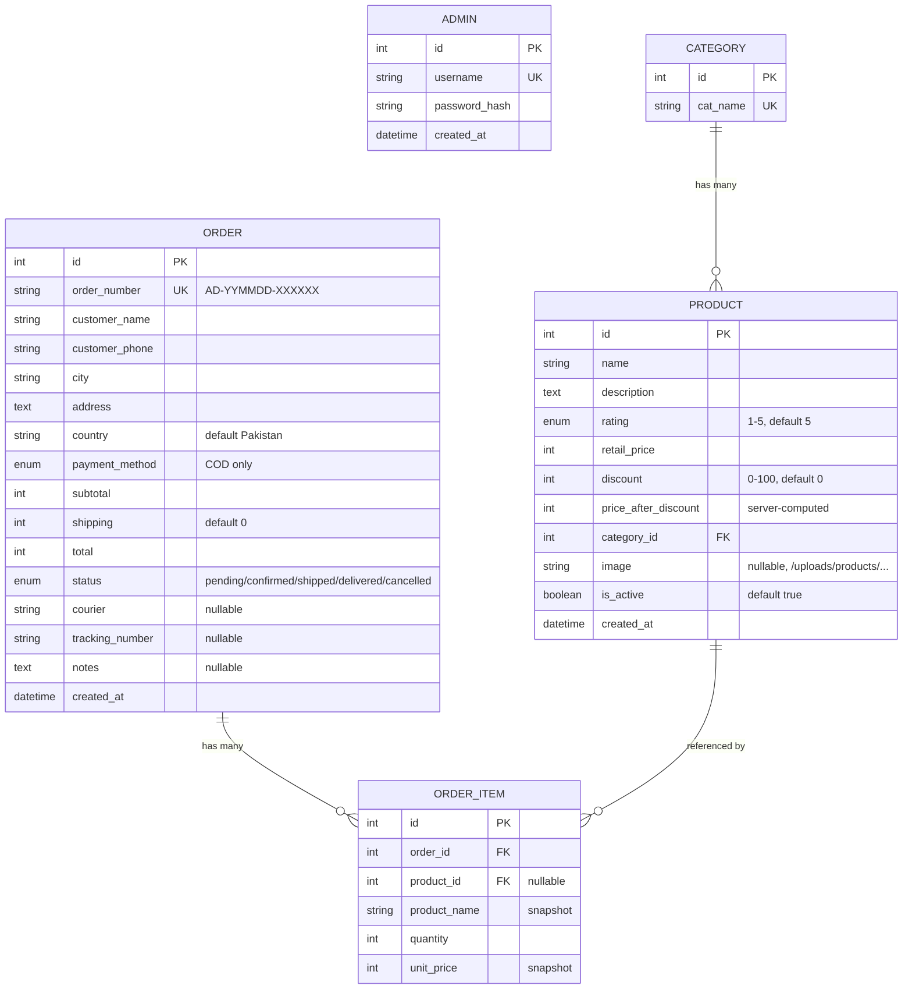

# Schema Design

Database: MySQL, accessed via Sequelize. Model source: `models/*.model.js`,
associations wired in `models/index.js`.

## Entity-relationship diagram



`ADMIN` has no relationships to other tables — it's purely for authenticating
the dashboard, not a `created_by` owner of data.

## Tables

### `admins`
| Column | Type | Notes |
|---|---|---|
| `id` | INTEGER, PK, autoincrement | |
| `username` | STRING(50) | unique, not null |
| `password_hash` | STRING(255) | not null, bcrypt hash |
| `created_at` | DATETIME | auto (`timestamps: true`, `updatedAt` disabled) |

No self-service signup — accounts are created/reset only via `scripts/seedAdmin.js` (a CLI script, not an API endpoint).

### `categories`
| Column | Type | Notes |
|---|---|---|
| `id` | INTEGER, PK, autoincrement | |
| `cat_name` | STRING(100) | unique, not null |

No timestamps at all. Deleting a category is blocked at the DB level (FK constraint) if any product still references it — the service layer translates that into a `409 "Cannot delete: this category has products"`.

### `products`
| Column | Type | Notes |
|---|---|---|
| `id` | INTEGER, PK, autoincrement | |
| `name` | STRING(200) | not null |
| `description` | TEXT | nullable |
| `rating` | ENUM('1'..'5') | not null, default `'5'` — stored as a string enum, not an integer |
| `retail_price` | INTEGER | not null, whole currency units (no decimals/cents) |
| `discount` | INTEGER | not null, default 0, percent 0-100 |
| `price_after_discount` | INTEGER | not null — **always derived**, never accepted from client input (`controllers/product.controller.js` deliberately never reads this field from `req.body`) |
| `category_id` | INTEGER, FK → `categories.id` | not null |
| `image` | STRING(255) | nullable, public path like `/uploads/products/<file>` |
| `is_active` | BOOLEAN | default true — soft "visibility" flag; inactive products 404 for public endpoints but remain visible to admin |
| `created_at` | DATETIME | auto, no `updatedAt` |

Price formula (`services/product.service.js`):
```
price_after_discount = round(retail_price - (retail_price * discount / 100))
```

### `orders`
| Column | Type | Notes |
|---|---|---|
| `id` | INTEGER, PK, autoincrement | |
| `order_number` | STRING(30) | unique, human-friendly, format `AD-YYMMDD-XXXXXX` (see [flow doc](./03-backend-flow.md)) |
| `customer_name` | STRING(120) | not null |
| `customer_phone` | STRING(20) | not null, normalized to `03XXXXXXXXX` format before saving |
| `city` | STRING(80) | not null |
| `address` | TEXT | not null |
| `country` | STRING(60) | default `'Pakistan'` |
| `payment_method` | ENUM('COD') | only value currently supported |
| `subtotal` | INTEGER | sum of `unit_price * quantity` across items, computed server-side |
| `shipping` | INTEGER | default 0; set manually by admin after order placement |
| `total` | INTEGER | `subtotal + shipping`, recomputed whenever shipping changes |
| `status` | ENUM('pending','confirmed','shipped','delivered','cancelled') | default `'pending'`; see state machine in [flow doc](./03-backend-flow.md) |
| `courier` | STRING(50) | nullable, admin-entered |
| `tracking_number` | STRING(60) | nullable, admin-entered |
| `notes` | TEXT | nullable, admin-entered |
| `created_at` | DATETIME | auto, no `updatedAt` |

No customer account/user table — orders are not linked to any login; `customer_name`/`customer_phone`/`address` are captured fresh on every order (guest checkout only).

### `order_items`
| Column | Type | Notes |
|---|---|---|
| `id` | INTEGER, PK, autoincrement | |
| `order_id` | INTEGER, FK → `orders.id` | not null |
| `product_id` | INTEGER, FK → `products.id` | **nullable** — intentionally: if a product is later deleted, the line item survives for order history |
| `product_name` | STRING(200) | not null — **snapshot** of the product name at order time, independent of later renames |
| `quantity` | INTEGER | not null |
| `unit_price` | INTEGER | not null — **snapshot** of `price_after_discount` at order time, independent of later price changes |

No timestamps. The snapshot fields (`product_name`, `unit_price`) exist specifically so historical orders stay accurate even if the product catalog changes later — this is a deliberate denormalization, not an oversight.

## Associations (`models/index.js`)

```js
Category.hasMany(Product, { foreignKey: 'category_id', as: 'products' });
Product.belongsTo(Category, { foreignKey: 'category_id', as: 'category' });

Order.hasMany(OrderItem, { foreignKey: 'order_id', as: 'items' });
OrderItem.belongsTo(Order, { foreignKey: 'order_id', as: 'order' });

Product.hasMany(OrderItem, { foreignKey: 'product_id' });
OrderItem.belongsTo(Product, { foreignKey: 'product_id' });
```

No migrations folder exists — tables are presumably created via `sequelize.sync()` or manual SQL (not found in the reviewed files); schema changes today happen by editing the model files directly.
