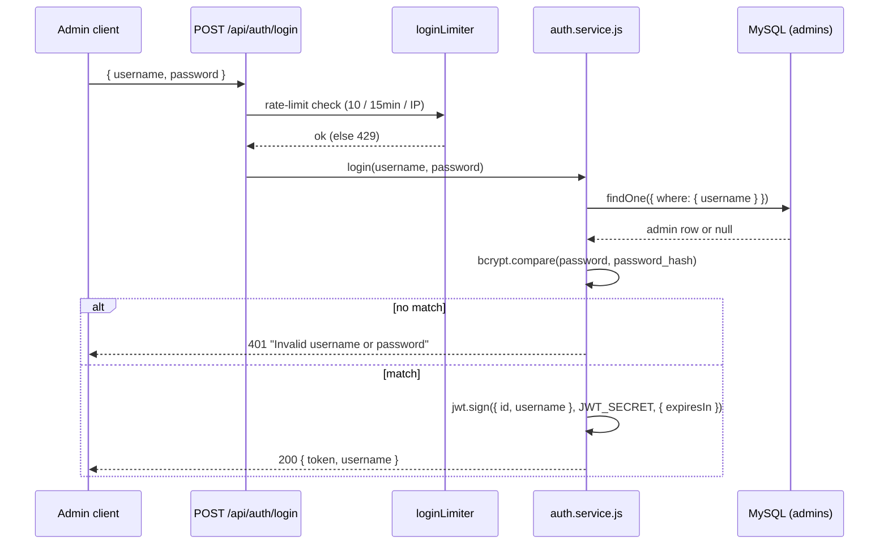
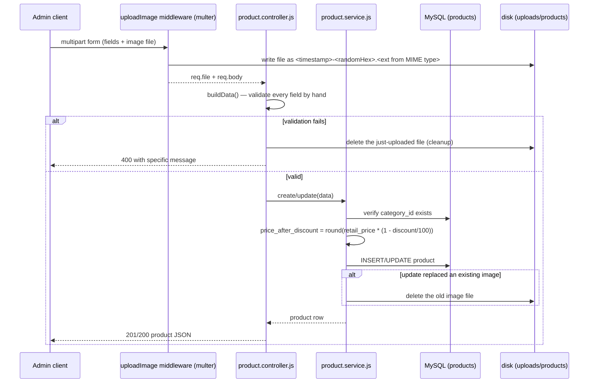
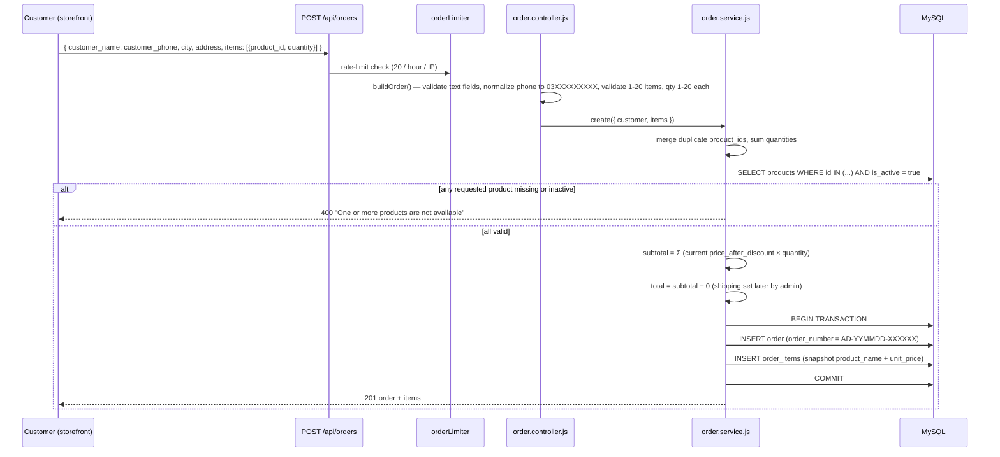
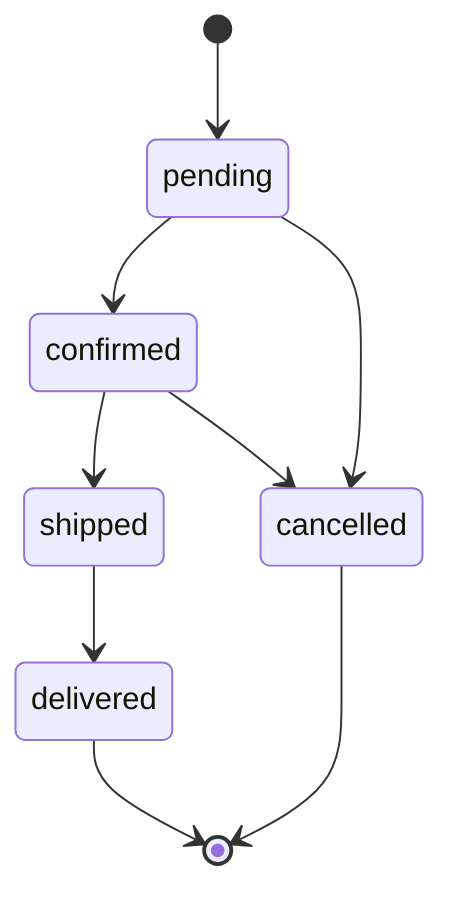
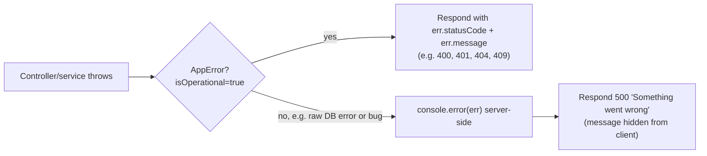

# Backend Flow

How the main user journeys move through the system, end to end.

## 1. Admin login

The client stores `token` and sends it as `Authorization: Bearer <token>` on every subsequent admin request. `GET /api/auth/me` is the cheapest way to check "am I still logged in" — it just echoes `req.admin.username` set by the `auth` middleware after verifying the JWT.

There is no logout endpoint: logging out is purely a client-side action (discard the token). The token stays valid server-side until it expires (`JWT_EXPIRES_IN`, default `1d`) — see [known issues](./05-known-issues.md).

## 2. Public catalog browsing

- `GET /api/categories` — all categories, no auth, used to populate filters/menus.
- `GET /api/products?category=ID` — only `is_active = true` products, optionally filtered by category, newest first.
- `GET /api/products/:id` — single product; if it exists but `is_active = false`, the API returns a **404** (not 403) — an inactive product should look identical to "doesn't exist" to a public client.

## 3. Admin catalog management (categories & products)

All writes require `Authorization: Bearer <token>` (checked by `middleware/auth.js`).

- **Categories:** plain CRUD. Create/update reject duplicate names with `409`; delete is blocked with `409` if any product still references the category (DB foreign key constraint, translated by the service layer).
- **Products:** create/update accept `multipart/form-data` (because of the optional image file). Flow for an image-bearing write:

Deleting a product also deletes its image file from disk (`productService.remove`).

## 4. Checkout — placing an order (public, no login)

This is the most business-critical flow: it must be impossible for a client to manipulate prices.

Key guarantees:
- **No client-supplied prices anywhere.** Every price in the order comes from a fresh DB read of `Product.price_after_discount` at the moment of checkout.
- **Snapshotting.** `order_items.product_name` and `.unit_price` are copied at order time so the order record stays accurate even if the product is later renamed, repriced, or deleted.
- **Atomicity.** Order + its line items are written in one Sequelize transaction — a crash mid-write can't leave an order with no items.
- **Order number** (`utils/orderNumber.js`): `AD-<YYMMDD>-<6 random chars>`, drawn from an alphabet that excludes visually-ambiguous characters (`0/O`, `1/I`) so it can be read aloud over a phone call — this is a COD business, so customer service calls are expected.

## 5. Admin order management

Enforced in `order.service.js` via a `NEXT_STATUS` transition table:
- `pending → confirmed | cancelled`
- `confirmed → shipped | cancelled`
- `shipped → delivered`
- `delivered` and `cancelled` are terminal — **any** further `PATCH` on a closed order (even just updating `notes`) is rejected with `409 "This order is closed and cannot be changed"`.
- Requesting a status not in the current state's allowed list returns `400`.

Besides `status`, an admin can PATCH `shipping`, `courier`, `tracking_number`, `notes`. Changing `shipping` recomputes `total = subtotal + shipping` automatically — subtotal itself is immutable after creation.

`GET /api/orders` supports `?status=` filtering and `?page=` pagination (fixed page size of 20, newest first).

## 6. Error handling (applies to every flow above)

Every async controller is wrapped in `asyncHandler`, so a thrown/rejected error always reaches this pipeline instead of crashing the process or hanging the request.
